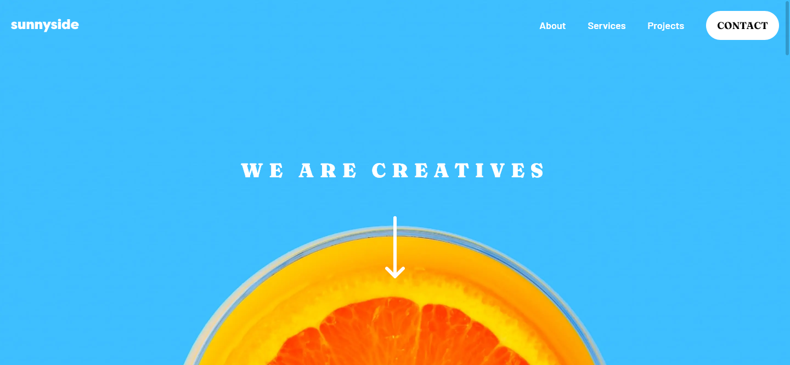

# Frontend Mentor - Sunnyside agency landing page solution

This is a solution to the [Sunnyside agency landing page challenge on Frontend Mentor](https://www.frontendmentor.io/challenges/sunnyside-agency-landing-page-7yVs3B6ef). Frontend Mentor challenges help you improve your coding skills by building realistic projects.

## Table of contents

- [Overview](#overview)
  - [The challenge](#the-challenge)
  - [Screenshot](#screenshot)
  - [Links](#links)
- [My process](#my-process)
  - [Built with](#built-with)
  - [What I learned](#what-i-learned)
  - [Continued development](#continued-development)
  - [Useful resources](#useful-resources)
- [Author](#author)

**Note: Delete this note and update the table of contents based on what sections you keep.**

## Overview

### The challenge

Users should be able to:

- View the optimal layout for the site depending on their device's screen size
- See hover states for all interactive elements on the page

### Screenshot

### Links

- Solution URL: [Add solution URL here](https://your-solution-url.com)
- Live Site URL: [https://fm-sunnyside-agency.vercel.app/](https://fm-sunnyside-agency.vercel.app/)

## My process

### Built with

- Semantic HTML5 markup
- CSS custom properties
- Flexbox
- CSS Grid
- Mobile-first workflow
- [Next.js](https://nextjs.org/) - React framework
- [Tailwind CSS](https://tailwindcss.com/)
- [Headless UI](https://headlessui.dev/)

**Note: These are just examples. Delete this note and replace the list above with your own choices**

### What I learned

- How to create a responsive navbar with Tailwind and Headless UI
- Image optimization with [NextJS/Image](https://nextjs.org/docs/api-reference/next/image)

### Continued development

I took more time than I expected to finish this project. During the development, I lost motivation to do it all.
In order to gather some motivation, I chunked the work into small pieces. I would ddo a small piece everyday instead of doing everything all at once.

It keeps me motivated to do small amount of work everyday.

In the future, I should start by chunking the project in small pieces and take time to do them instead of rushing the project.

### Useful resources

- [Tailwind UI](https://tailwindui.com/#components) - This helped me to create a responsive menu

## Author

- Frontend Mentor - [@TonyTangDev](https://www.frontendmentor.io/profile/tonytangdev)
- Twitter - [@TonyTangDev](https://www.twitter.com/TonyTangDev)

